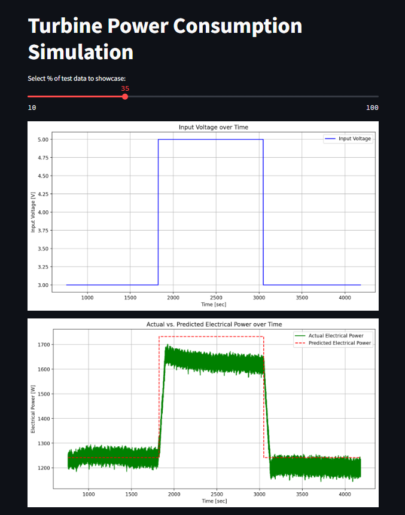

## Power Consumption Simulation Model<br><br>
[Model development](https://github.com/JeffM-Code/PortfolioWork/tree/main/ML/GasTurbineConsumption)<br><br>
[App](https://turbinepowerconsumptionsimulationmodel.streamlit.app/)<br><br>

The slider changes the % of data applied onto model for it to predict on, and the graphs either show voltage input over time or actual and predicted power over time.<br><br>

### Example:<br><br>
<br><br>

### Model analysis:<br><br>
```
X_train = train_df[['input_voltage']]
y_train = train_df['el_power']

X_test = test_df[['input_voltage']]
y_test = test_df['el_power']

```
<br>

Input voltage and electrical power features directly influence model performance, as the better the selction of training features or predictors, the better the quality of predictions output by the model.<br><br>

The input voltage is an important factor that influences the electrical power output of the micro gas turbine, with the relationship between input voltage and electrical power being dynamic and time-dependent, and as a ket factor, input voltage should then be a significant predictor of electrical power (el_power), therefore is a good feature to select for the model.<br><br>


### Expected Model Performance:<br><br>

```
Mean Squared Error: 236800.64012962865
R^2 Score: 0.6477735114045802

```